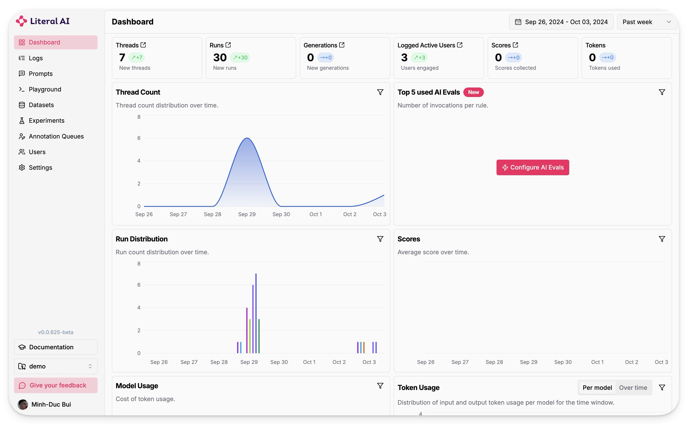

# E2E Chainlit Chatbot

This application manages various chatbot services using Chainlit and LlamaIndex. It provides a flexible framework for building and deploying chatbots with advanced capabilities.

https://github.com/user-attachments/assets/14b418b9-c825-4c1d-9548-544077525e70

## Table of Contents
- [Features](#features)
- [Setup](#setup)
- [Usage](#usage)
- [Demo](#demo)
- [Contributing](#contributing)
- [License](#license)

## Features

- **Detail logging steps**: Logs each step of the workflow in detail.
- **Multi-step workflows**: Supports complex interactions with users through multi-step workflows, allowing for more engaging conversations.
- **Prompt optimization**: Automatically optimizes user prompts for better responses, enhancing the overall user experience.
- **Web Search**: Integrates a web search capability using the Tavily search tool to provide real-time answers based on user queries.
- **Authentication**: Supports user authentication via **GitHub** and **Google**, allowing for secure access to the chatbot services.
- **LiteLLM**: LiteLLM provides a proxy server to manage auth, loadbalancing, and spend tracking across 100+ LLMs. All in the OpenAI format.
- **Literal AI**: Literal AI is the go-to LLM evaluation and observability platform built for Developers and Product Owners.

## Setup

To set up the project, follow these steps:

1. **Clone the repository**:

    ```bash
    git clone https://github.com/bmd1905/e2e-chainlit-chatbot.git
    cd e2e-chainlit-chatbot
    ```

2. **Install the required dependencies**:

    ```bash
    # Create and activate environment
    conda create -n e2e-chainlit-chatbot python=3.11 -y
    conda activate e2e-chainlit-chatbot

    # Install libraries
    pip install -r requirements.txt
    ```

3. **Install pre-commit dependencies**:

    ```bash
    pre-commit install
    ```

## Usage

1. **Start the LiteLLM proxy server**:

    ```bash
    make litellm
    ```

2. **Start the chatbot service**:

    ```bash
    make cl
    ```

3. **Access the chatbot**: Open your browser and navigate to `http://localhost:8000` to interact with your chatbot.

4. **Chat with the bot**: Once the application is running, you can start chatting with the bot. It will respond based on the configured workflows and models. For example, you can ask it questions or give it commands related to its capabilities.

## Demo





## Contributing

If you would like to contribute to this project, please fork the repository and submit a pull request. Make sure to follow the coding standards and include tests for any new features.

## License

This project is licensed under the MIT License. See the LICENSE file for more details.
